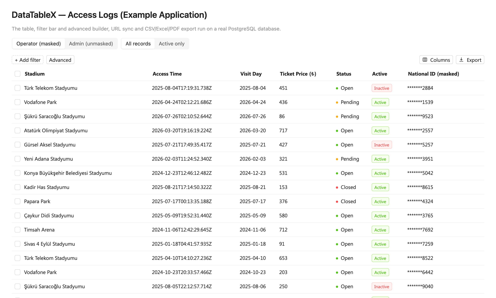

# DataTableX

[](https://github.com/ersinozdmr/datatablex/actions/workflows/ci.yml)
[](LICENSE)

A server-driven data table for React: a headless hook and Ant Design components on the client, and a Fastify and Kysely query engine on the server that only answers what its allowlist permits.



## Features

- **Server-side everything.** Pagination, sorting, filtering and global search run in PostgreSQL. The client sends one query object; the server validates it and translates it to SQL.
- **An allowlist, not a query builder.** Every field, operator and sort the client may use is declared on the endpoint. Anything else is rejected with a `400`, and endpoint limits (page size, filter depth and count, search length) are enforced.
- **Sensitive fields.** A field marked `sensitive` cannot be searched, sorted or matched by substring, so its value cannot be recovered by probing with filters.
- **Filters.** A filter bar with editors per column type, and an advanced builder for nested AND/OR groups.
- **Columns.** Show, hide, reorder, resize and wrap columns; the layout is persisted per table.
- **URL sync.** Page, sorting, filters and search can live in the URL, through a built-in History API adapter or your router (examples for React Router and Next.js are in the docs of `@datatablex/react`).
- **Export.** CSV, Excel and PDF, built in the browser or streamed from the server out of a single database snapshot.
- **Headless or ready-made.** Use the `useDataTable` hook with your own UI, or the Ant Design `<DataTable>`. English and Turkish locales are included.

## Quick start

Install the server packages next to Fastify and Kysely:

```bash
npm install @datatablex/fastify @datatablex/core fastify kysely pg
```

Describe the endpoint and register its routes:

```ts
import Fastify from "fastify";
import { Kysely, PostgresDialect } from "kysely";
import pg from "pg";
import { datatableRoute } from "@datatablex/fastify";

interface DB {
  orders: {
    id: number;
    customer_name: string;
    status: string;
    total: number;
    created_at: Date;
  };
}

const db = new Kysely<DB>({
  dialect: new PostgresDialect({
    pool: new pg.Pool({ connectionString: process.env.DATABASE_URL }),
  }),
});

const orders = datatableRoute(db, {
  table: "orders",
  primaryKey: "id",
  // Only these fields, with these operators, can be queried.
  fields: {
    id: { column: "id", type: "number", sortable: true, filterOperators: ["eq", "in"] },
    customerName: {
      column: "customer_name",
      type: "text",
      sortable: true,
      searchable: true,
      filterOperators: ["contains"],
    },
    status: { column: "status", type: "enum", filterOperators: ["in", "notIn"] },
    total: {
      column: "total",
      type: "number",
      sortable: true,
      filterOperators: ["gte", "lte", "between"],
    },
    createdAt: {
      column: "created_at",
      type: "datetime",
      sortable: true,
      filterOperators: ["gte", "lt"],
    },
  },
  // Map the user your authentication layer has already verified.
  getContext: () => ({ userId: "demo", roles: ["viewer"] }),
  authorize: (ctx) => ctx.roles.includes("viewer"),
});

const app = Fastify();
app.post("/api/orders/query", orders);
app.get("/api/orders/query/meta", orders.meta);
await app.listen({ port: 3000 });
```

Install the client packages next to React and Ant Design:

```bash
npm install @datatablex/antd @datatablex/react @datatablex/core antd react react-dom
```

Render the table:

```tsx
import { DataTable } from "@datatablex/antd";
import { createRestDataSource } from "@datatablex/react";
import type { ReactDataTableColumn } from "@datatablex/react";

interface Order {
  id: number;
  customerName: string;
  status: string;
  total: number;
  createdAt: string;
}

const dataSource = createRestDataSource<Order>({
  endpoint: "/api/orders/query",
  metaEndpoint: "/api/orders/query/meta",
});

const columns: ReactDataTableColumn<Order>[] = [
  { key: "id", title: "ID", type: "number", sortable: true },
  {
    key: "customerName",
    title: "Customer",
    type: "text",
    sortable: true,
    searchable: true,
    filterable: true,
  },
  {
    key: "status",
    title: "Status",
    type: "enum",
    filterable: true,
    options: [
      { label: "Open", value: "open" },
      { label: "Closed", value: "closed" },
    ],
  },
  { key: "total", title: "Total", type: "number", sortable: true, filterable: true },
  { key: "createdAt", title: "Created", type: "datetime", sortable: true, filterable: true },
];

export function OrdersTable() {
  return (
    <DataTable
      dataSource={dataSource}
      columns={columns}
      rowKey="id"
      tableId="orders"
      searchable
      columnManagement
    />
  );
}
```

The [example application](apps/example) is a complete setup on a real PostgreSQL database, with roles, a sensitive field, server export and end-to-end tests.

## Packages

| Package                                   | Version                                                                                                           | What it is                                                                                 |
| ----------------------------------------- | ----------------------------------------------------------------------------------------------------------------- | ------------------------------------------------------------------------------------------ |
| [`@datatablex/core`](packages/core)       | [](https://www.npmjs.com/package/@datatablex/core)       | The wire contract: query, result and filter types, plus zero-dependency helpers            |
| [`@datatablex/fastify`](packages/fastify) | [](https://www.npmjs.com/package/@datatablex/fastify) | The backend: allowlisted endpoint config, query validation, SQL translation, server export |
| [`@datatablex/react`](packages/react)     | [](https://www.npmjs.com/package/@datatablex/react)     | The headless layer: `useDataTable`, REST and local data sources, URL sync, export          |
| [`@datatablex/antd`](packages/antd)       | [](https://www.npmjs.com/package/@datatablex/antd)       | The Ant Design components: `<DataTable>`, filter bar, column menu, export menu             |

The packages are released together and share one version number; install the same version of each.

## Compatibility

| Dependency | Supported                    |
| ---------- | ---------------------------- |
| React      | 18 and 19                    |
| Ant Design | 5 (`^5.20.0`); 6 is not yet  |
| Fastify    | 5                            |
| Kysely     | `>=0.28.17 <0.30.0`          |
| Node.js    | 22 or later (server package) |
| PostgreSQL | Tested with PostgreSQL 16    |

## Stability

The packages are in `0.x`: a breaking change may ship in a minor release. [STABILITY.md](STABILITY.md) says which parts of the API are stable, experimental or internal, and what kind of release each change needs.

## Contributing

See [CONTRIBUTING.md](CONTRIBUTING.md) for the setup and the conventions, and [SECURITY.md](SECURITY.md) for reporting a vulnerability.

## License

[MIT](LICENSE)
